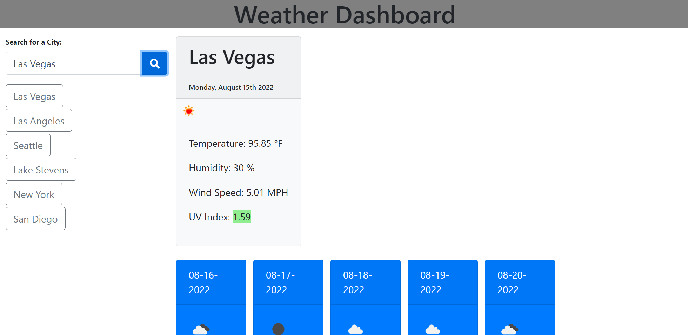

# Weather-dashboard

This is the sixth challenge of my UW coding bootcamp curriculum.

For this challenge, we had to follow the acceptance criteria to fetch and display weather data from user inputed city names

The user is prompted to search for a city. After searching the user is displayed with current weather conditions, as well as future weather conditions for the next 5 days. Cities searched are saved to local storage and displayed on the left side

This was developed from scratch using bootstrap, moment.js, and jquery.

View a screenshot of the dashboard

View the deployed site [Here:](https://noahbrown26.github.io/Weather-dashboard/)

